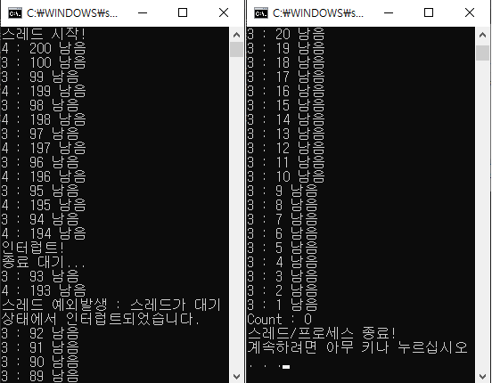
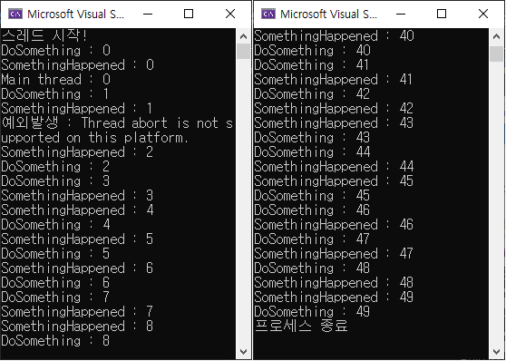
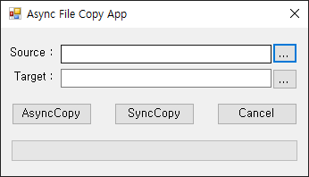
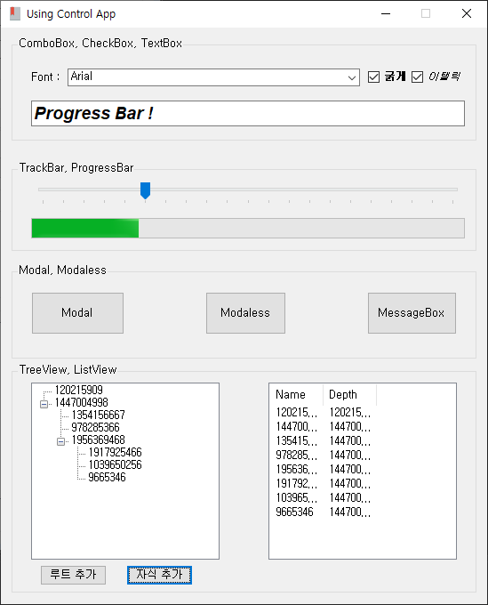
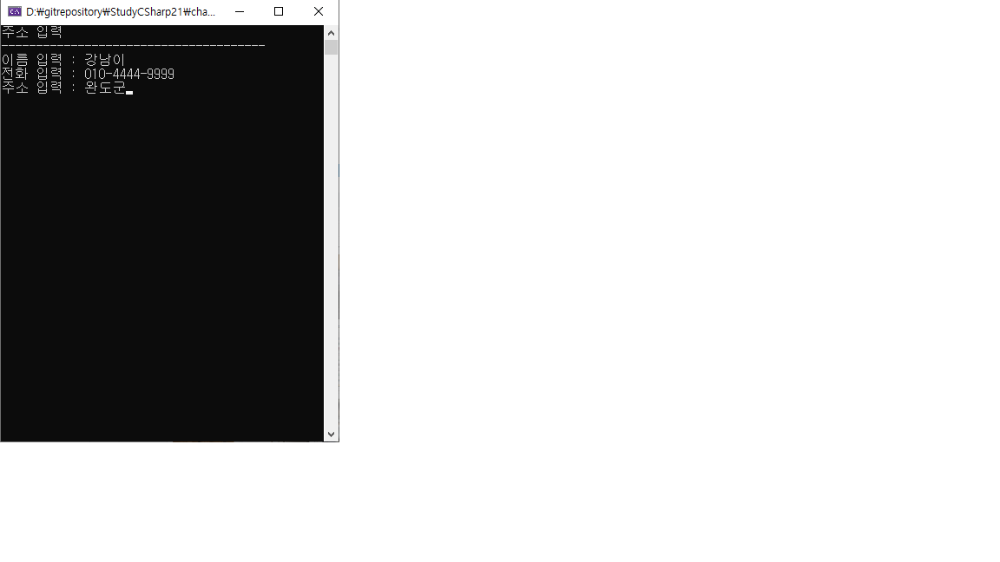
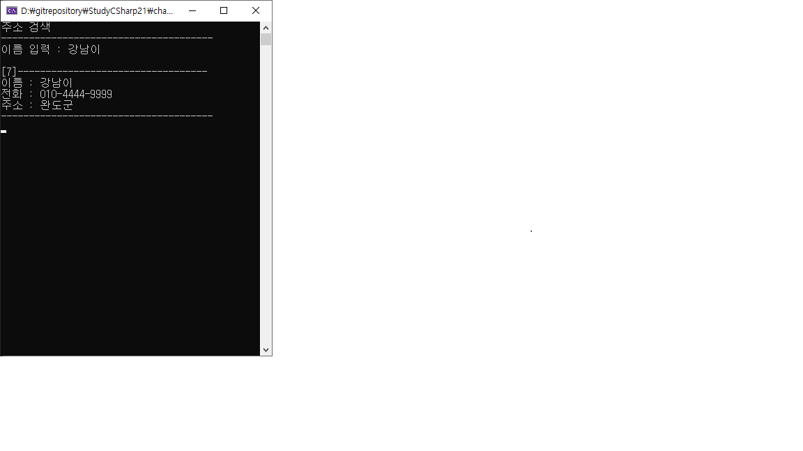
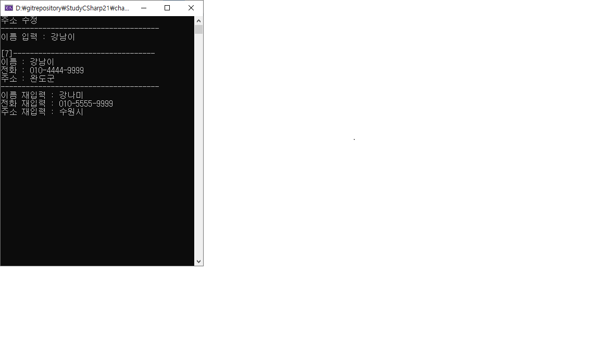
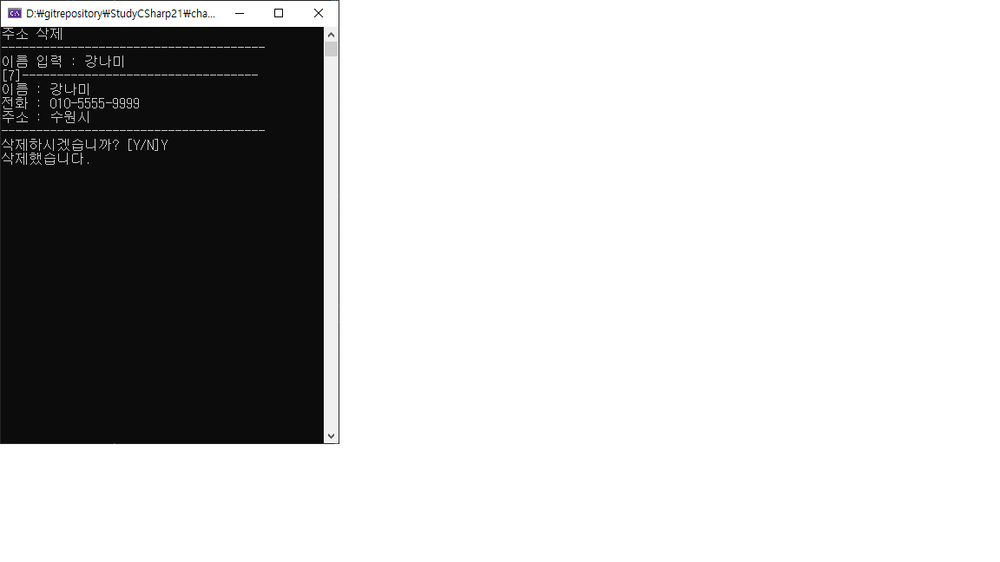
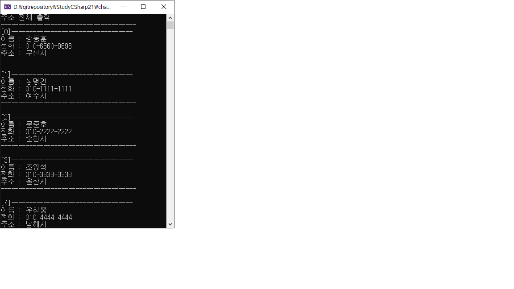
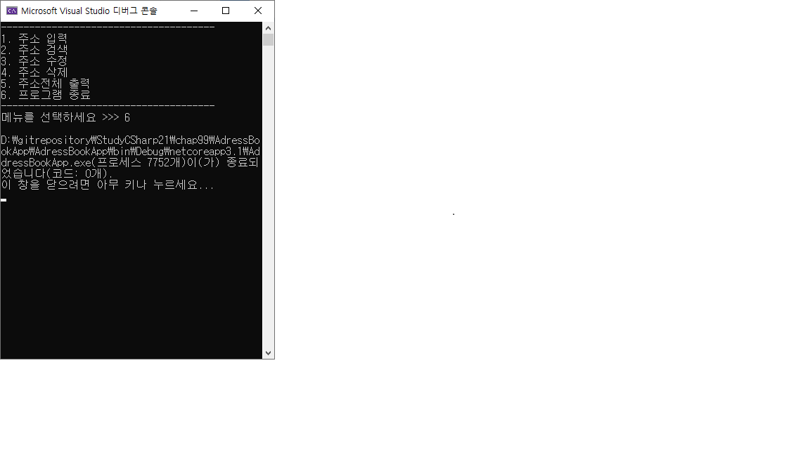

# StudyCSharp

PKNU C# 학습 리포지토리

------------------------------------------------------------------------------------
## C#

[Chap03 Source](https://github.com/Kang0325/StudyCSharp21/tree/main/chap03/Chap03App)

[Chap04 Source](https://github.com/Kang0325/StudyCSharp21/tree/main/chap04/Chap04App)

[Chap05 Source](https://github.com/Kang0325/StudyCSharp21/tree/main/chap05/Chap05App)

[Chap06 Source](https://github.com/Kang0325/StudyCSharp21/tree/main/chap06/Chap06App)

[Chap07 Source](https://github.com/Kang0325/StudyCSharp21/tree/main/chap07/Chap07App)

[Chap08 Source](https://github.com/Kang0325/StudyCSharp21/tree/main/chap08/Chap08App)

[Chap09 Source](https://github.com/Kang0325/StudyCSharp21/tree/main/chap09/Chap09App)

[Chap10 Source](https://github.com/Kang0325/StudyCSharp21/tree/main/chap10/Chap10App)

[Chap11 Source](https://github.com/Kang0325/StudyCSharp21/tree/main/chap11/Chap11App)

[Chap12 Source](https://github.com/Kang0325/StudyCSharp21/tree/main/chap12/Chap12App)

[Chap13 Source](https://github.com/Kang0325/StudyCSharp21/tree/main/chap13/Chap13App)

[Chap15 Source](https://github.com/Kang0325/StudyCSharp21/tree/main/chap15/Chap15App)

[Chap18 Source](https://github.com/Kang0325/StudyCSharp21/tree/main/chap18/Chap18App)

-------------------------------------------------------------------------------------
## WinForm

### Chap19 [Source](https://github.com/Kang0325/StudyCSharp21/tree/main/chap19/Chap19App)

SideTaskApp

ThreadStateApp

###Chap20 [Source](https://github.com/Kang0325/StudyCSharp21/tree/main/chap20/Chap20App)

FileCopyApp

UsingControlsApp

-------------------------------------------------------------------------------------
## 주소록 프로젝트

[Project Source](https://github.com/Kang0325/StudyCSharp21/tree/main/chap99/AdressBookApp)

#### 주소록 프로젝트 실습 진행 화면
1. 주소 입력

2. 주소 검색

3. 주소 수정

4. 주소 삭제

5. 주소 전체 출력

6. 프로그램 종료

